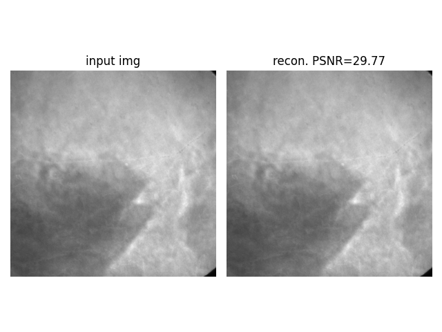
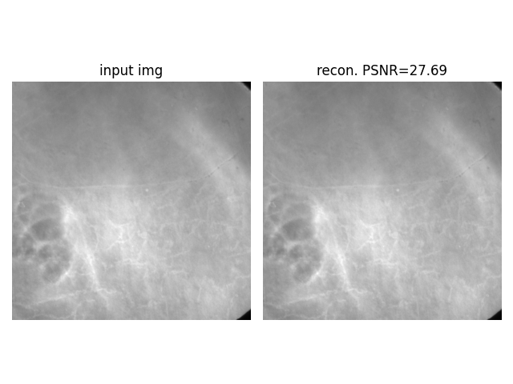

# Diffusion Model學習紀錄  

中文記錄diffusion相關模型的知識，並用自己的習慣重新整理各種奇怪版本、可讀性糟糕的code，學到哪更新到哪。

## Denoising Diffusion Probabilistic Models (DDPM)  

附上我在hackmd上的筆記: [盡量白話解釋DDPM基礎](https://hackmd.io/@jackson29/rkpmHlK6C)  
內容對應的code就在[ddpm.py](ddpm.py)  
包含最重要的兩個工具```DDPM_Trainer```跟```DDPM_Sampler```

## Denoising Diffusion Implicit Models (DDIM)  

Code已經整理好了，但文檔還沒寫完，待更新

## Latent Diffusion

整理了部分Latent Diffusion作者開源的[code](https://github.com/CompVis/latent-diffusion)，放在[latent_diffsion_VAE](latent_diffsion_VAE)資料夾裡  
因為他們的code真的挺亂的，內部又盤根錯雜，整理起來很吃力  
目前把VAE的部份給分離了出來並用自己的習慣重新編輯了  
確認過在我自己的資料上訓練正常，有空再弄得可讀性更好一點  
為了盡量避免改動到原作者的設定，我也同樣使用```pytorch lightning```做訓練

### VAE

我只使用了AutoencoderKL，因為VQVAE實在是怎麼train都很爛，附上我用NanoCT資料的重建結果:




## 其他repo.推薦  

這邊是我看到Github上面可讀性較高、適合初學者看的repo.

1. [DenoisingDiffusionProbabilityModel-ddpm-](https://github.com/zoubohao/DenoisingDiffusionProbabilityModel-ddpm-)<br>應該是最適合初學者的看的，這個repo用Cifar10資料集去跑DDPM，絕大多數人的硬體都跑的了。它有完全沒加condition，以及用class當做condition，共兩種版本可以玩。但好像有一段在算posterior variance的部分看起來怪怪的，跟原論文有出入，不過我實際跑過後的結果影響不大。

2. [Stable Diffusion implemented from scratch in PyTorch](https://github.com/hkproj/pytorch-stable-diffusion)<br>stable diffusion的教學，甚至還附上YouTube教學影片與PPT。code可讀性不錯，蠻多註解的，不過它主要是做inference跟基礎教學，如果想要自己從頭開始train就沒辦法參考這篇太多。
